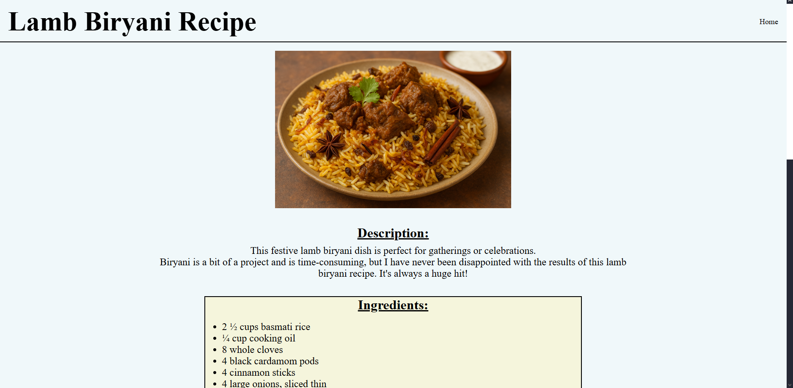

# odin-recipes

A simple recipe website built as part of The Odin Project’s Foundations course.  
The project focuses on basic HTML structure, linking between pages, and organizing content cleanly.

## Live Demo
[View on GitHub Pages](https://sai-eshwar-supreet.github.io/odin-recipes/)

## Preview

## Features
- Three fully formatted recipe pages  
- Internal navigation between recipes  
- Clean project structure using basic HTML  
- Beginner-friendly layout
- Simple CSS file for formatting the pages

## Recipes Included
All recipes are adapted from AllRecipes:

 - [Lamb (Gosht) Biryani](https://www.allrecipes.com/recipe/212487/lamb-gosht-biryani/)
 - [Chicken Biryani](https://www.allrecipes.com/recipe/16102/chicken-biryani/)
 - [Prawn Biryani](https://www.allrecipes.com/recipe/165456/prawn-biryani/)

## Attribution
Food recipes sourced from AllRecipes.  
Images generated using ChatGPT.